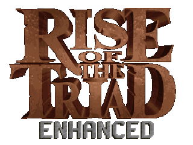

# Rise of the Triad: Enhanced

An enhanced port of Rise of the Triad, based on SDL3.

Video updates can be found on my [YouTube channel](https://www.youtube.com/@erysdren).

## Features

- Developer console with a number of useful commands
- Limited support for loading ROTT:LE levels
- Ludicrous amounts of code cleanup and junk removal

## Download

Work-in-progress versions can be downloaded under [Tags](https://github.com/erysdren/ROTTEN/tags), and under [Actions](https://github.com/erysdren/ROTTEN/actions).

## Building

Building requires [SDL3](https://github.com/libsdl-org/SDL), [SDL3_Net](https://github.com/libsdl-org/SDL_net), and [SDL3_Mixer](https://github.com/libsdl-org/SDL_mixer).
At the time of writing, these are still under active development are not likely
to be packaged in your distro (if using Linux). Otherwise, the normal command
is:

```bash
mkdir cmake-build && cd cmake-build
cmake -DCMAKE_BUILD_TYPE=Release ..
make
```

## Contributors

- [Paril](https://github.com/Paril/)
- [vs49688](https://github.com/vs49688/)
- [Begasus](https://github.com/Begasus)
- [sirbaratusii](https://github.com/sirbaratusii)
- [ROTT Central](https://discord.gg/GaNQMFWwes)

## Required Assets

### The HUNT Begins

| Filename     | SHA-1                                    |
|--------------|------------------------------------------|
| HUNTBGIN.RTL | 9a2bcd49a6a9710f95158edee5f3111baca0cea2 |
| HUNTBGIN.WAD | faa232a2078c209c7d4ba125655a55213369c8de |
| REMOTE1.RTS  | 945f1c126de553cd6e11b9c40e9dd05a103ee25a |

### Dark War

| Filename    | SHA-1                                    |
|-------------|------------------------------------------|
| DARKWAR.RTL | f7b7ff2ca68d2402893878d1fbfb112a664dfd10 |
| DARKWAR.WAD | 2e9a4f9c38b166994d415959bf5b15d7273f1db2 |
| REMOTE1.RTS | 945f1c126de553cd6e11b9c40e9dd05a103ee25a |

### Extreme ROTT

| Filename    | SHA-1                                    |
|-------------|------------------------------------------|
| EXTREME.RTL | 098885bbd9a649d47f0792f563b6ef217e099951 |
| DARKWAR.WAD | 2e9a4f9c38b166994d415959bf5b15d7273f1db2 |
| REMOTE1.RTS | 945f1c126de553cd6e11b9c40e9dd05a103ee25a |

### The HUNT Continues

| Filename        | SHA-1                                    |
|-----------------|------------------------------------------|
| huntcontEX.rtlx | 583055509c2a8f2a127e5b09819270f2e9990d47 |
| DARKWAR.WAD     | 2e9a4f9c38b166994d415959bf5b15d7273f1db2 |
| REMOTE1.RTS     | 945f1c126de553cd6e11b9c40e9dd05a103ee25a |

## Sources

- [icculus.org/rott/](https://icculus.org/rott/)
- [riseofthetriad.dk](https://dukenukemcentral.com/mirrorsites/www.riseofthetriad.dk/)
- [github.com/fabiangreffrath/rott/](https://github.com/fabiangreffrath/rott/)
- [github.com/hogsy/hrotte/](https://github.com/hogsy/hrotte/)
- [github.com/LTCHIPS/rottexpr/](https://github.com/LTCHIPS/rottexpr/)
- [github.com/DaveGamble/cJSON/](https://github.com/DaveGamble/cJSON/)

## License

GNU GPL v3

Copyright (C) 1994-1995 Apogee Software, Ltd.

Copyright (C) 2002-2024 Steven Fuller, Ryan C. Gordon, John Hall, Dan Olson, Fabian Greffrath

Copyright (C) 2023-2024 erysdren (it/she/they)

This program is free software: you can redistribute it and/or modify
it under the terms of the GNU General Public License as published by
the Free Software Foundation, either version 3 of the License, or
(at your option) any later version.

This program is distributed in the hope that it will be useful,
but WITHOUT ANY WARRANTY; without even the implied warranty of
MERCHANTABILITY or FITNESS FOR A PARTICULAR PURPOSE.  See the
GNU General Public License for more details.

You should have received a copy of the GNU General Public License
along with this program.  If not, see <https://www.gnu.org/licenses/>.
